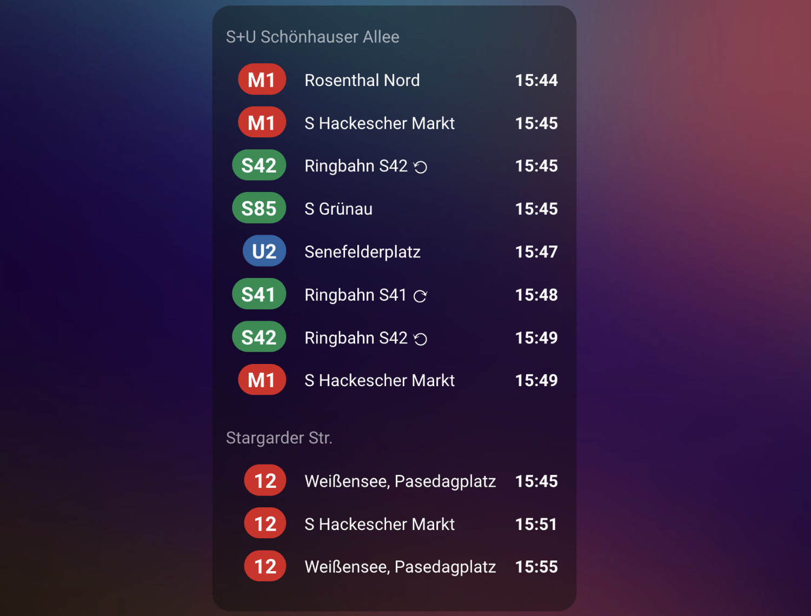

# Lovelace card for Berlin (BVG) and Brandenburg (VBB) transport integration

Custom lovelace card that displays upcoming departures from your defined public transport stops for Berlin and Brandenburg.

**The integration itself can be found here: https://github.com/vas3k/home-assistant-berlin-transport**

This card works only after you installed and configured the integration.



> I use [iOS Dark Mode Theme](https://github.com/basnijholt/lovelace-ios-dark-mode-theme) by @basnijholt, installed from [HACS](https://hacs.xyz/)

## 💿 Installation

This Lovelace card can be installed via [HACS](https://hacs.xyz/) or manually.

> ⚠️ Make sure you installed the [BVG integration](https://github.com/vas3k/home-assistant-berlin-transport) first. This card would not work without it.

## Using HACS

**1.** Open HACS interface from your Home Assistant sidebar

**2.** Add this repository `https://github.com/vas3k/home-assistant-berlin-transport-card` as a custom repository (Three dots in top right corner -> Custom repositories)

**3.** Select "Lovelace" as a category

**4.** Go to `Settings -> Devices & Services -> Add integration` and search for this card name (just type `Berlin`)

**5.** Install it. Now you can add it to your dashboard


### Installing the card manually

**1.** Copy the [berlin-transport-timetable-card.js](./dist) card module to the `www` directory of your Home Assistant. The same way you did for the sensor above. If it doesn't exist — create one.

**2.** Go to your Home Assistant dashboard, click "Edit dashboard" at the right top corner and after that in the same top right corner choose "Manage resources".

**3.** Add new resource with URL: `/local/berlin-transport-timetable-card.js` and click create. Go back to your dashboard and refresh the page.

**4.** Now you can add the custom card and integrate it with your sensor. Click "Add card -> Manual" or just go to "Raw configuration editor" and use this config.

```yaml
- type: custom:berlin-transport-timetable-card
  show_stop_name: true # show or hide the name of your stop in card title
  max_entries: 8 # number of upcoming departures to show (max: 10)
  entities:
    - sensor.stop_id_900110001 # use your entity IDs here
    - sensor.stargarder_str # they might be different from mine
  show_cancelled: true # show or hide the cancelled departures. When not defined or true, the cancelled departures will be shown as struk-through.
```


## 🎨 Styling

If you want to change any styles, font size or layout — the easiest way is to use [card_mod](https://github.com/thomasloven/lovelace-card-mod) component. It allows you to change any CSS classes to whatever you want.

## ❤️ Contributions

Contributions are welcome. Feel free to [open a PR](https://github.com/vas3k/home-assistant-berlin-transport-card/pulls) and send it to review. If you are unsure, [open an Issue](https://github.com/vas3k/home-assistant-berlin-transport-card/issues) and ask for advice.

## 🐛 Bug reports and feature requests

Since this is my small hobby project, I cannot guarantee you a 100% support or any help with configuring your dashboards. I hope for your understanding.

- **If you find a bug** - open [an Issue](https://github.com/vas3k/home-assistant-berlin-transport-card/issues) and describe the exact steps to reproduce it. Attach screenshots, copy all logs and other details to help me find the problem.
- **If you're missing a certain feature**, describe it in Issues and try to code it yourself. It's not hard. At the very least, you can try to [bribe me with a PayPal donation](https://www.paypal.com/paypalme/vas3kcom) to make the feature just for you :)

## 👮‍♀️ License

- [MIT](./LICENSE.md)
